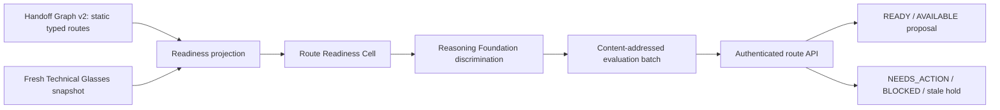

# Mirror Dynamic Route Readiness Growth Action Report

Date: 2026-07-18  
Status: WORKING / TEST / NEEDS_REVIEW  
CANON: no; only Mike may accept CANON

## Outcome

Mirror now has a new hard-coded organ for a relation that learned weights must
not own: current route readiness. Static compatibility and dynamic readiness
remain separate evidence layers.

Handoff Graph v2 still discovers manifest-bound exact typed routes without a
module-ID catalog. The new Route Readiness Overlay automatically projects the
current typed readiness requirements for every module in those routes from
Workshop Technical Glasses. An independent cell applies the Workshop ordering:

1. any `UNKNOWN`, `OFFLINE`, or `TRIPPED` requirement makes the route `BLOCKED`;
2. otherwise any `USER_ACTION` makes it `NEEDS_ACTION`;
3. otherwise any `AVAILABLE` or `OPTIONAL` makes it `AVAILABLE`;
4. otherwise the route is `READY`.

Every route classification is then run through the deterministic Reasoning
Foundation against a false-READY alternative. The resulting immutable private
batch contains the machine assessment and linked human rendering, but creates
no training receipt and takes no world action.

## Why a new organ was warranted

The previous static graph intentionally left runtime readiness unknown. A fresh
Technical Glasses audit supplied a distinct typed relation with explicit
ordering, live observations, evidence paths, and a missing-means-UNKNOWN rule.
Putting that relation inside the static compatibility graph would mix two
different truths: whether modules can exchange a type and whether their current
requirements are ready.

This organ is hard-coded because readiness gates are a safety and truth
boundary. Learned weights may not rewrite the ordering, freshness limit,
permissions, or release gates. The extensible part is data-driven: new
manifest-bound routes, route modules, readiness requirement IDs, and changed
states enter the next batch without editing Mirror. No Workshop module or
dependency ID appears in the classifier.

## Architecture

The loopback Technical Glasses reader is an observation adapter, not part of
the decision authority. It refuses non-loopback or HTTPS targets, caps the
response at 5 MiB, and falls back to the Workshop's latest local snapshot when
refresh fails. The organ validates the typed snapshot, exact manifest and
contract evidence paths, declared/pass flags, and graph membership. A missing
module, mismatched evidence path, unsupported state, invalid snapshot, or stale
observation becomes an explicit hold.

## Current evidence

Static source graph:

- batch `reasoning-handoff-graph-627524b8983dd7079ff2`;
- 33 manifest-bound contracts and six refused undeclared contract files;
- 21 direct plus 16 depth-two routes.

Technical Glasses state:

- schema `axm.technical-glasses/v1`;
- fingerprint `ab03fee549a8240f43ee8ee34822078b6180471ada1539c19e069453fb88aa63`;
- projected state digest `410ff03be35cd24843ce91068b2c3f089cfa227e253bf7bc53a3548d11c49004`;
- 16 routed modules and 51 typed readiness requirements;
- freshness window: 300,000 ms.

Immutable readiness batch:

- ID `reasoning-route-readiness-513d4de63414c6522bfa`;
- input digest `513d4de63414c6522bfa187ceb2fc391a375a41ef8481ccb2ff7fbae39d8c89a`;
- batch digest `5b71bc80a250740293135e4873b2da1f45b2b8b0ca8ed61b60a28254b67c9c43`;
- file SHA-256 `8fe4cc92669d00f477e79d7a0bfce622e544a147a4ba7ac7b91a60156f75c6ed`;
- 336,573 bytes;
- five `READY`, two `AVAILABLE`, zero `NEEDS_ACTION`, and 30 `BLOCKED` routes;
- 37/37 classifications matched the independent expected state;
- zero classification mismatches, training receipts, or world actions.

The batch is content-addressed by the static graph, projected readiness state,
implementation contract, and five source files. Observation time is kept
separate: recompiling an unchanged live state reuses the same batch while the
response still proves freshness. A changed requirement state produces a new
immutable batch; tests preserve and verify both old and new directories.

## Live runtime checks

The runtime was safely restarted as PID `31256` at
`2026-07-18T12:51:41.952Z`. It reports learned weights `false` and exposes the
new organ with no start, repair, permission, readiness mutation, training,
tool, world, or promotion authority.

Authenticated session `session-eac8c24fbd6136f921f17191` observed four
different live outcomes:

- `discovery-engine -> knowledge-canvas -> project-room` was a fresh `READY`
  review proposal, not executed; response digest
  `c42edc83bb92e7e65315bc66e45ad78972f2e1403cf59933c95f3d1caeeea046`.
- `chatgpt-connector -> game-hub` was `AVAILABLE`; its response explicitly says
  a separate start is required and nothing was executed; response digest
  `d240abd73f4ebb21f39c9624989ac35fdfbdcc2dec8115b6d9c05b1c11d53fbe`.
- `ui-ux-builder -> studio -> game-hub` was statically compatible but
  `BLOCKED`: Studio's `asset-hands` requirement is `UNKNOWN`, while Game Hub's
  `game-runtime` is only `AVAILABLE`; response digest
  `959d20f632295ff580a74db0d989668069068404e99b686af83fd53ce8e5fdb9`.
- `body-pulse -> game-hub` remained `HOLD_UNBOUND_MODULE_CONTRACT`; dynamic
  readiness cannot bypass static manifest binding; response digest
  `e1e6fbdecb5d112fb1f24827364a1129b3c02f42fb4640ee389dea7f483c464c`.

All response authority fields were false. The runtime refreshed Technical
Glasses read-only before each request. No service was started or repaired.

## Practice and Learning Shell

Automatic practice report
`curriculum-20260718125144773-9a33d5563412` records the same 5/2/0/30
distribution, 37/37 matched classifications, zero readiness training receipts,
and zero world actions. The ignored report is 11,046 bytes with SHA-256
`56fcab39ced7c37a63fa8b0593925fa791ecceb0463f2a0354ec185132b9fe07`.

Fresh Learning Shell session `learning-shell-mrqd9r84-4675005d` completed all
seven stages and reused the readiness batch. Its `training.json` is 1,157,720
bytes with SHA-256
`43dab90946bfc863538889105c1387dc4c0af399cca2ae63bb3661f059ac5bc7`.
The readiness batch is stored beside the challenger artifacts, not admitted to
the training corpus. The shell remains `HOLD_REPAIR` because the separate token
corpus is small; this readiness milestone does not pretend to repair that seam.

## Verification

- Mirror core: 101/101 tests passed.
- Learning Forge: 99/99 tests passed.
- Native Learning Shell: 6/6 tests passed.
- Focused readiness tests cover the exact precedence ordering, injected reader
  boundary, READY/AVAILABLE/NEEDS_ACTION/BLOCKED routes, stale evidence,
  mismatched manifest/contract evidence, automatic state-change batches,
  batch tampering, and private session tampering.
- Mirror Doctor: `Structure: PASS`.
- 190 repository-visible JSON files parsed successfully.
- Forge journal: valid, three current events, head
  `9c7afd7f0ddb9f68c88de7df9325d4416cc1fc2140276fd617ac1ccadad09e9a`.
- The first `npm` invocation was blocked by local PowerShell script policy;
  `npm.cmd` ran the identical package script successfully.

## Changed implementation surfaces

The main additions are:

- `kernel/route-readiness-cell.js`;
- `organs/reasoning-route-readiness-organ.js`;
- `adapters/workshop/technical-glasses-reader.js`;
- three typed readiness schemas;
- `tests/reasoning-route-readiness-organ.test.js`;
- runtime, automatic curriculum, and Learning Shell integration;
- package runner, API contract, training policy, model BOM, status, Doctor,
  module contract, manifest, and documentation updates.

Private batch, session, snapshot, token, report, and checkpoint state remains
ignored and was not staged or committed.

## Known limits

- This is bounded structural and live-observation evidence, not general
  intelligence or proof of correct module behavior.
- Thirty of 37 current routes are blocked because their declared dependencies
  lack adequate live probes. The organ preserves that gap; it does not invent
  probes or repair services.
- Compatibility remains limited to exact one-hop and non-cyclic depth-two
  routes. A new composition depth or relation needs reviewed organ work.
- The readiness state vocabulary and precedence are intentionally hard-coded.
  If Workshop changes that contract, Mirror must version and retest this organ;
  learned weights cannot silently adapt a safety gate.
- The reader observes the Workshop's compiled evidence; it does not independently
  execute every dependency probe.
- No manual dashboard/browser visual review was run in this milestone.
- No genuine negative real-local reasoning receipt was produced.

This milestone is `TEST`, not `CANON`, until Mike reviews and accepts it.
