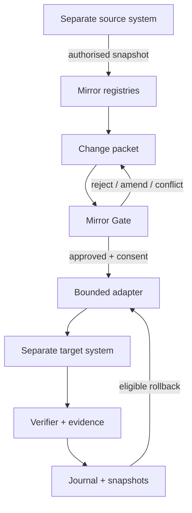

# Architecture

Mirror Core is a local coordination underlay between independently authoritative systems. A native system exports an authorised snapshot; Mirror registers a representation and evidence; a change remains inert until it passes validation, review, permission, consent, precondition, and adapter checks.

## Components

| Layer | Responsibility | Explicitly not responsible for |
|---|---|---|
| Schemas | Versioned records and interaction compatibility shapes | Executing changes |
| Registry/graph | Stable mirror IDs, representations, evidence, relations, mappings, capabilities | Claiming native identity equivalence |
| Gate | Default-deny permissions, specific consent, human review, conflict checks | Inferring consent |
| Journal/snapshots | Attribution, ordered hash links, local snapshots and diffs | External immutability or notarisation |
| Bridge | Discover and invoke a bounded adapter | General filesystem/network access |
| Adapter | Translate an approved packet into one native system | Becoming the authority for other systems |
| Verifier | Compare expected target revision/hash with the resulting mock state | Proving physical or real-world truth |
| Local API/UI | Visible review and explicit actions on loopback | Background synchronisation |
| Foundation adapter | Discovery and shape compatibility harness | Installation into PR 13 Foundation |

## Authority boundaries

- The source owns its native record.
- The target owns its native record.
- Mirror owns the change packet, mapping claim, consent receipt, journal, and application receipt.
- A mapping means a reviewed relation between representations. It does not collapse two native objects into one authority.
- Approval records a decision. Application is a separate operation and requires current permission, active consent, adapter mode, and unchanged preconditions.
- AI and human actors are attributed with the same record shape. Neither actor type receives implicit application power.

## Storage and runtime

The prototype uses atomic JSON replacement for registries/receipts, newline-delimited append events, and separate snapshot files. Runtime is zero-dependency Node.js, loopback-only, without telemetry or external calls. This is appropriate for a deterministic local prototype, not a multi-process production service.

## Shared-controls split

Live controls and Mirror packets have different latency, authority, and durability:

| Concern | Shared controls | Mirror Core |
|---|---|---|
| Unit | seat-bound action intention | reviewed change packet |
| Lifetime | ephemeral/session | durable/audited |
| Frequency | game/input cadence | occasional governance event |
| Authority | game server/engine | target adapter after Mirror Gate |
| Observation | that seat's player-visible view | selected evidence/snapshots with consent |
| Human/AI parity | identical control surface | identical packet attribution, permission checked separately |

Mirror Core supplies forward-compatible schemas for the seam but does not run the game loop.
