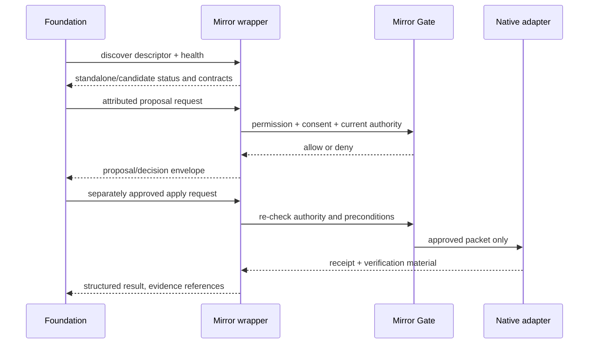

# Foundation integration plan

Current status: **STANDALONE FOUNDATION-COMPATIBILITY HARNESS — NOT YET INSTALLED INTO THE ACTIVE AXM FOUNDATION**.

The practical route is an adapter promotion, not a merge of the whole local package into Foundation.

## Candidate placement

After the incoming shared-controls work is available and pinned, place the reviewed service wrapper beside PR 13's shared service contracts, with Mirror Core remaining a separately owned package. The likely Foundation-facing module is a small `shared/services/mirror-core` wrapper plus launcher registration; exact destination and registration API must be revalidated against the promotion SHA rather than inferred from this frozen PR.

The wrapper should expose:

- `mirror.health`
- `mirror.query`
- proposal create/preview/decision
- approved apply/verify/rollback
- explicit adapter connect/disconnect

It should translate Foundation service envelopes to local methods in `foundation-adapter/pr13-compatibility.js`. It must not bypass `MirrorGate` or expose `JsonStore` directly.

## Discovery sequence

## Workspace routes

| Consumer | Future read path | Future write path | Guardrail |
|---|---|---|---|
| Project Room | Approved project/mapping reference | Its own adapter applies an approved packet | Native project remains Project Room-owned |
| Knowledge Canvas | Entity, relation, provenance, evidence references | Separate proposal for knowledge representation changes | No automatic canon |
| Evidence Desk | Evidence ID, hash, claim scope, storage reference, limitations | Evidence Desk stores/organises its own reference | Mirror does not embed secret/raw payloads by default |
| Asset Vault | Asset reference and approved mapping | Vault adapter only | Asset ownership/version stays in Vault |
| Game Hub/living world | Selected snapshots, entity references, capability metadata | Bounded adapter after review | Never route live input through Mirror packets |
| AI Team | Attributed proposal/decision envelope | Same permission path as a human actor | No hidden machine permissions |

## Living-world adapter handshake

1. The future world publishes a versioned adapter descriptor and limitations.
2. The user grants a specific consent receipt: adapter, system, purpose, data categories, operations, mode, and revocation path.
3. Foundation asks Mirror Gate to connect. Discovery alone never connects.
4. The adapter exports only selected authorised entities/evidence.
5. Changes are proposed against a target revision and field preconditions.
6. Human review sees exact operations, truth unknowns, evidence, risk, reversibility, and conflicts.
7. Apply re-checks permission, consent, adapter mode, authority revision, and target revision.
8. The adapter returns a native receipt; verifier creates bounded evidence; rollback remains conditional.

## Shared-controls promotion gate

When the upcoming shared-controls branch exists:

1. Record repository, PR/branch, full SHA, and exact contract blobs.
2. Compare seat/session/action/observation fields against `schemas/interaction`.
3. Remove any hardcoded default occupants or default AI replacement from the promoted contract.
4. Prove 1–8 occupied seats, arbitrary teams, and uneven team sizes.
5. Prove human and AI bindings invoke the same action allowlist, validation, rate limits, and server authority.
6. Prove AI observations contain only fields derived from its bound seat's player-visible view.
7. Prove live intentions do not enter the Mirror journal at frame/input cadence.
8. Keep a separate opt-in Mirror proposal for durable outcomes such as an approved project, asset, evidence, or capability record.

## Promotion tests

- Foundation discovers the service without logging payloads.
- Restart/restore retains registries, consents, receipts, and journal validity.
- Foundation's advisory gate cannot override Mirror's default-deny gate.
- Actor/profile IDs resolve and revoked/disconnected actors are denied.
- Project Room, Knowledge Canvas, Evidence Desk, Asset Vault, Game Hub, and AI Team consume references without silent native writes.
- Stale target, changed permission, revoked consent, unsupported operation, duplicate mapping, and verifier mismatch all fail visibly.
- Foundation launcher and existing workspace tests pass unchanged.
- Public package scan finds no secrets, absolute user paths, runtime internet dependency, or private payload logs.

Only after these pass should the status move from `standalone_foundation_compatibility_harness` to `foundation_candidate`. `foundation_installed` requires an actual reviewed Foundation integration and is not claimed here.
