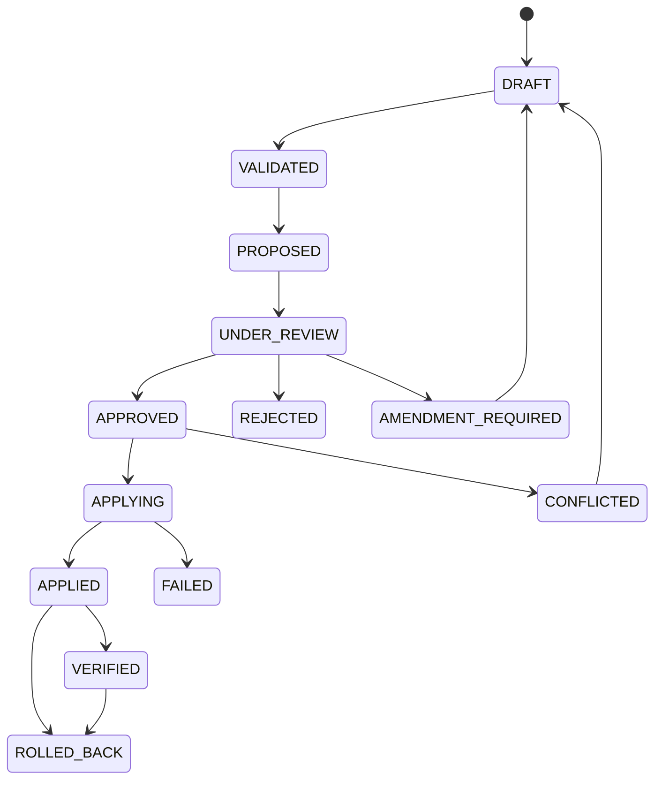

# Mirror packet lifecycle

A packet records source/target, snapshots, target and authority revisions, actor, intent/reason, exact operations, affected entities, preconditions, evidence, risk, reversibility, requested permissions, approval rules, expiry, decisions, receipt, and rollback reference.

## Decision and application are separate

Validation checks schema/contract and rejects executable-looking content. Proposal makes the request visible. Review records a human decision. Approval does not mutate the target. Apply checks:

1. packet is `APPROVED` and unexpired;
2. applying actor has `apply_change`;
3. adapter is connected in `approved_apply`;
4. active consent covers adapter, service, system, mode, scope, and every operation;
5. authority revision is unchanged;
6. target revision and field preconditions still match;
7. operations and mappings remain supported and non-conflicting.

If a conflict exists, the packet becomes `CONFLICTED` and no target write occurs. No last-write-wins fallback exists.

## Verification and rollback

Apply captures a pre-snapshot, invokes the adapter, captures a post-snapshot, records core effects and an application receipt, and journals attribution. Verification compares the native adapter revision/hash with its receipt and stores a bounded verifier evidence record.

Rollback is conditional: adapter support, available snapshots, permission/consent, and an unchanged post-apply target revision are mandatory. It restores native fixture content, reverses mapping/entity/relation/capability effects, records a new snapshot, and never erases history.
