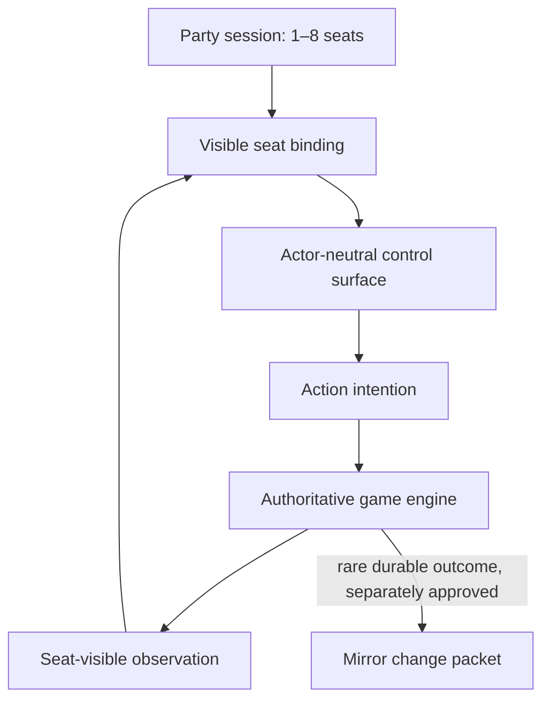

# Shared-controls compatibility

This is a forward contract for the incoming controls work, not a claim that PR 13 already implements it.

## Product invariant

A party may contain one to eight occupied seats. Humans and connected AI systems are optional occupants. A missing player stays an unoccupied seat; it is never silently replaced by AI. Teams may have any number of seats and may be uneven. Each occupied seat has a visible binding to one actor and one controller adapter.

Human and AI occupants receive the same game-defined control surface:

- same action IDs and payload schemas;
- same validation and rate limits;
- same session/seat binding rules;
- same server-authoritative resolution;
- no hidden machine-only actions or permissions.

An AI may receive a semantic observation instead of pixels only when every field is demonstrably derived from what the player in that seat could perceive. It receives no authoritative server state, omniscient entity list, hidden opponents, private teammate data, or other seat's view.

## Structured seam

| Schema | Purpose | Critical invariant |
|---|---|---|
| `party-session/v1` | session, 1–8 seats, arbitrary team layout | `default_ai_fill: false` |
| `seat-binding/v1` | visible actor/controller assignment | one actor/adapter/control surface/observation scope |
| `control-surface/v1` | versioned per-game action allowlist | actor-neutral, no hidden machine actions, intentions only |
| `action-intention/v1` | session-bound input from a seat | attributed sequence and allowlisted action |
| `observation/v1` | seat-scoped player-visible observation | player-view basis and withheld fields |

## What Mirror Core stores

Mirror Core may later store an approved session summary, project/evidence/capability result, or asset mapping. It does not store every input, control a seat, choose a team, generate AI, decide substitutes, expose a screen feed, or become the authoritative game engine.

## Migration from frozen PR 13

The frozen Game Hub source has useful eight-seat and input-intention foundations, but the visible lobby still hardcodes four occupants and older contracts disagree with newer engine files. The migration must:

1. remove hardcoded occupants from the session template;
2. represent available seats separately from occupied bindings;
3. support 1–8 occupied seats and uneven teams in validation and UI;
4. require explicit opt-in for every AI adapter binding;
5. compile both human and AI clients against the same control-surface version;
6. attach an observation-scope proof to semantic AI observations;
7. keep presence, identity, shared controls, and Mirror governance as distinct services;
8. rerun contract tests against the incoming source SHA before integration.

## Required parity tests

- Empty seats remain empty after lobby creation and disconnect.
- 1v1, 2v1, 3v2, free-for-all, cooperative, and eight-seat layouts validate when allowed by the game.
- A human and an AI bound to the same seat type produce byte-compatible intention envelopes for the same action.
- A machine-only action ID is rejected.
- An action from an unbound/wrong seat or stale sequence is rejected.
- Rate limits apply equally.
- An observation containing authoritative, omniscient, hidden-entity, or other-player private state is rejected.
- Revoking the AI adapter consent unbinds or pauses that seat without auto-replacement.
- The game loop continues without requiring Mirror Core.
- A durable outcome enters Mirror only through a separate reviewed change packet.
