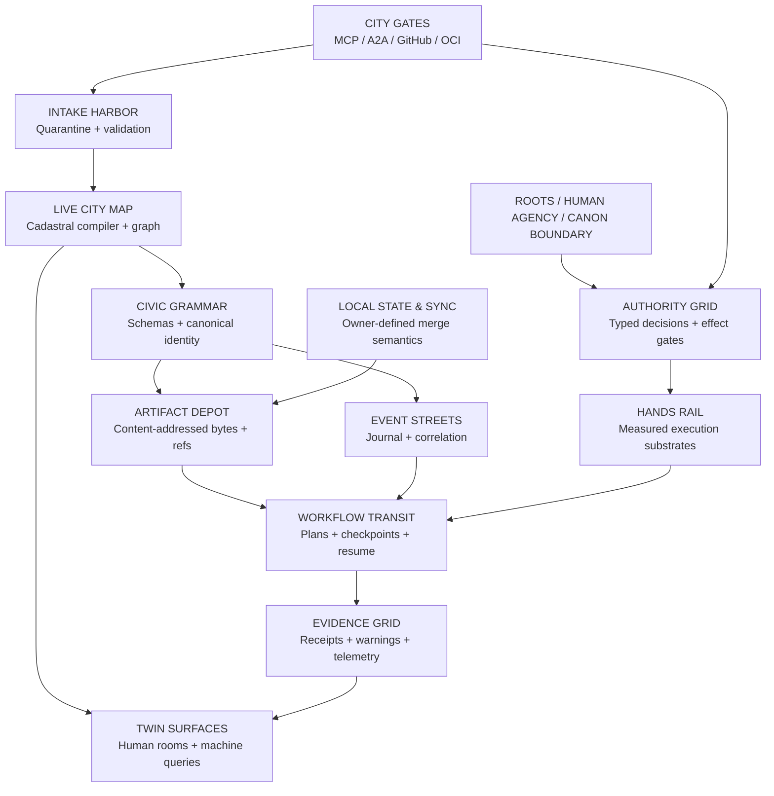

# AXM LEGO CITY — Grounded Architecture Buildmap v0.1

**Date:** 2026-08-15  
**Status:** PROPOSED / REVIEW-READY / NO AUTOMATIC CANON  
**Scope:** `mike-axiom-mir/axm-collaboration-platform`, its open pull requests, adjacent AXM repositories as separate districts, and a bounded cross-ecosystem scan of high-signal public software standards.  
**Final authority:** Mike.  
**Change rule:** Preserve the working platform. Add compatibility views and civic infrastructure before replacing anything.

---

## 0. Executive verdict

The cheatcode is real, but it is not “more software.”

The strongest grounded direction is:

> **Stop building applications as isolated products. Build bounded capability blocks around one shared civic substrate, then let humans and machines compose those blocks into rooms, workflows, tools, games, research systems, and future physical systems.**

AXM already contains much of the required DNA:

- typed module contracts;
- explicit permissions and refusals;
- capability registries;
- evidence receipts;
- deterministic research;
- handoff proposals;
- human review gates;
- local-first operation;
- rollback and continuity structures;
- public-safe boundaries;
- early production, cache, lease, retention, archive, and publication machinery.

The missing layer is not another mega-tool. It is a **live city graph and a small shared civic grammar** that lets every existing and future part know:

1. what it is;
2. what sockets it exposes;
3. what it consumes and produces;
4. what effects it may cause;
5. who can authorize those effects;
6. what proof is required;
7. what state it owns;
8. how it can be stopped, repaired, replaced, or rolled back;
9. how a human sees it;
10. how a machine discovers and composes it.

The main architectural danger is now **islands with excellent local rules but too many independently invented seams**.

The first build should therefore be a **Cadastral Compiler / Live City Map Gate**, not a new end-user product.

---

## 1. What was actually inspected

### 1.1 Connected GitHub state

The connected GitHub surface exposed:

- `mike-axiom-mir/axm-collaboration-platform` — the primary platform;
- `mike-axiom-mir/axm-local-game-hub` — a connected play/distribution district;
- `mike-axiom-mir/axm-factual-space-simulator` — a connected simulation district;
- `mike-axiom-mir/axm-many-race-rts-current` — a private project district.

This report does **not** silently merge those repositories. The collaboration platform is treated as the city foundation; the other repositories remain separately owned districts that may connect through declared gates later.

### 1.2 Main platform snapshot

The inspected main branch was at commit:

`a4f99fbfc05268173458bf3fb8f3fe616919e376`

That commit merged the deterministic PR checkpoint.

The generated public discovery snapshot reports:

- 210 indexed tools;
- 1,769 declared capabilities;
- 210 structurally valid module contracts;
- a heavily experimental/test-weighted status distribution.

These are **generated snapshot counts**, not proof that every live source path is currently represented.

### 1.3 Open pull requests inspected

- **PR #29** — AI-native game production runner
- **PR #30** — hardware and compute research modules
- **PR #32** — deterministic complete-warning delta
- **PR #33** — deterministic PR publisher

The open PR heads passed the current public-launch workflow at inspection time. That is useful evidence, but the current workflow has a discovery-coverage blind spot described below.

### 1.4 External scan boundary

“The whole human web” was interpreted honestly as a broad but bounded scan of high-signal official standards and mature design patterns, including:

- Model Context Protocol;
- Agent2Agent Protocol;
- JSON Schema 2020-12;
- CloudEvents;
- WebAssembly Component Model and WASI;
- OpenTelemetry;
- in-toto attestations and SLSA-style provenance;
- Sigstore;
- OCI artifact layouts and ORAS;
- Nix content/dependency addressing and rollback;
- Cedar- and OPA-style policy decisions;
- local-first CRDT systems such as Automerge;
- LSP-style reusable intelligence services;
- managed lifecycle patterns.

This was not a literal crawl of every webpage. The point was to mine reusable mechanisms, not import entire ecosystems.

---

## 2. Strongest existing AXM foundations

### 2.1 Contracts are already first-class

AXM’s module template already asks modules to declare:

- what they provide;
- what they consume;
- permissions;
- handoffs;
- writes;
- refusals;
- lifecycle state.

That is the correct beginning of a machine-native city.

### 2.2 Capability is already separated from authority

The generated discovery system explicitly says that:

- a declaration is not runtime proof;
- a capability catalog does not grant authority;
- structural eligibility is not promotion;
- a self-test is not human approval.

This distinction is one of AXM’s strongest roots. Do not flatten it.

### 2.3 The ten-service foundation plane is a real civic seed

The platform already names ten persistent service categories:

- wisdom;
- identity;
- gate;
- storage;
- connectors;
- guardian;
- mirror;
- plugins;
- backup;
- runtime.

This is not yet a full runtime service mesh, but it is already a useful constitutional map of what the city must keep represented even when a service is offline or degraded.

### 2.4 Handoffs are proposal-first

The artifact handoff broker already:

- finds compatible producers and consumers;
- distinguishes exact and wildcard matches;
- creates review-required proposals;
- carries provenance;
- refuses automatic import and automatic permission changes;
- can attach translation-loss receipts.

That is exactly the right human-agency direction.

Its current IDs use time and randomness, so it should later distinguish:

- **occurrence identity** — unique event/run ID;
- **semantic identity** — canonical content digest.

### 2.5 Research is becoming deterministic

The deterministic research foundation already contains:

- goal normalization;
- hypothesis routing;
- experiment design;
- gap classification;
- evidence ledgers;
- backlog ranking;
- repeatable CLI paths.

PR #30 correctly reuses this foundation instead of inventing research from scratch.

### 2.6 Production and publishing now have exact receipts

PR #29 and PR #33 show that AXM is learning to bind:

- exact inputs;
- exact graph/plan state;
- exact artifacts;
- exact remote state;
- exact approval packets;
- partial-failure receipts;
- independent verification.

That is more important than a polished UI. It is the beginning of accountable machine construction.

---

## 3. Critical findings

## 3.1 Finding A — the city map can be internally consistent while missing buildings

The public workflow verifies that the checked-in discovery registries agree with `tools-index.json`.

It does **not** currently prove that `tools-index.json` agrees with the live `tools/` tree.

The deterministic PR checkpoint is present on main as a real tool with:

- a manifest;
- a module contract;
- a self-test;
- a CLI;
- shared core files.

However, it is absent from the checked-in `tools-index.json` search surface and was not added to the generated public registries when PR #31 merged. The public workflow still passed because it compared generated views to the same stale upstream index.

### Consequence

A machine can receive a perfectly self-consistent map that omits real capabilities.

That is more dangerous than an obvious broken map because the omission looks authoritative.

### Required repair

Create one source-ordered build:

`live filesystem → manifests/contracts → block graph → capability/authority/evidence views → human docs`

CI must regenerate this graph in a clean temporary location and fail if checked-in generated files differ.

No generated map may be considered fresh merely because it agrees with another generated map.

---

## 3.2 Finding B — excellent local organs are becoming infrastructure islands

The platform has many strong local contracts, but generic mechanisms are repeatedly embedded inside domain modules.

PR #29 is the clearest example. Under a game-production label it includes:

- generic durable workflow execution;
- generic checkpointing;
- generic content-addressed caching;
- generic cache leases;
- generic retention proposals;
- generic archive curation;
- generic archive rollups;
- generic portable tier export and restore;
- generic execution-confinement probes.

Those are not game-only abilities. They are civic utilities.

### Consequence

If future film, document, research, robotics, and simulation systems independently copy these mechanisms, AXM gains many “nearly the same” infrastructures that cannot safely share state or verification.

### Required repair

Preserve PR #29, but treat it as a **domain incubator/quarry**:

- do not discard it;
- do not silently rewrite it;
- do not let new districts depend directly on all of its internals;
- extract generic organs behind compatibility adapters;
- leave the game-production profile as a consumer of those organs.

---

## 3.3 Finding C — the authority map is honest but stale and partial

The authority observatory snapshot measured 81 modules and already reported:

- contract-authority unknowns;
- incomplete declarations;
- permission drift.

The newer public registry reports 210 tools.

The observatory correctly refuses to call declarations runtime grants, but it is no longer a complete city authority map.

### Required repair

Authority mapping becomes a generated projection of the same live city graph, with:

- source commit;
- source graph digest;
- freshness state;
- explicit unknowns;
- permission/effect mismatch;
- proof freshness;
- runtime enforcement evidence;
- no “safe” conclusion from missing declarations.

---

## 3.4 Finding D — PR #33 has a receiver-state gap

PR #33’s publisher:

- plans against an existing draft PR;
- creates a draft PR;
- reads back `isDraft`;
- records the draft state in its receipt.

But the final receipt checks do not require `pullRequestDraft === true`.

A human or race condition could mark the PR ready after planning and before final readback, while the receipt still passes its existing checks.

### Required repair before merge

Add a final receiver check:

`pull-request-draft: transport.pullRequestDraft === true`

Add a negative self-test that changes the mocked receiver from draft to non-draft between planning and final inspection and requires a FAIL receipt.

This is a small repair with a large integrity benefit.

---

## 3.5 Finding E — “WASM” or “Node permission mode” must never equal “sandbox” by label

PR #29’s own confinement probe is appropriately honest: some capabilities were denied, but loopback network access remained possible, so it did not claim a malicious-code sandbox.

External component systems also show that portable component interfaces and actual host authority are separate questions.

### Required rule

Every executor declares:

- its substrate;
- what it attempted to deny;
- what was actually tested;
- what remained reachable;
- what evidence supports the claim;
- what it explicitly does not protect against.

No runtime name grants a safety claim.

---

## 4. The cheatcode

## 4.1 One graph, many realities

> **Compile one city graph; render many realities.**

The same underlying block graph should produce:

- a beginner-friendly room for a person;
- a detailed technical map for a builder;
- a capability resolver for an AI;
- a permission/effect review for a steward;
- a route planner for an orchestrator;
- a health map for operations;
- a public-safe discovery surface;
- an offline package manifest;
- a compatibility report for another AXM district.

The UI is a view.

The CLI is a view.

The MCP server is a view.

The A2A agent card is a view.

The README is a view.

The city graph is the shared compiled truth surface, while the actual source contracts and evidence remain authoritative inputs.

## 4.2 Do not replace the current contracts

Do **not** create a third manually maintained truth file beside `manifest.json` and `module.contract.json`.

Instead create:

`axm.block-view/v1`

This is a deterministic compiled view assembled from:

- manifest;
- module contract;
- evidence references;
- source fingerprints;
- runtime probes;
- status/promotion state;
- compatibility metadata.

Old modules remain valid through adapters. New fields can be added gradually.

---

## 5. LEGO taxonomy

Every city piece is a **Block**, but blocks have different civic roles.

### Brick

A pure deterministic transformer.

- no retained state;
- no network;
- no filesystem mutation;
- same semantic input produces same semantic output;
- easiest unit to verify and reuse.

Examples:

- canonical JSON;
- schema validation;
- format translation;
- compatibility matching;
- digest calculation;
- deterministic ranking.

### Sensor

A read-only observer that emits measured facts.

Examples:

- filesystem inventory;
- Git state observer;
- runtime capability probe;
- warning scanner;
- health probe;
- dependency scanner.

A Sensor may be wrong or incomplete. Its receipt must name scope and freshness.

### Organ

A bounded stateful service.

Examples:

- artifact index;
- event journal;
- workflow scheduler;
- capability registry;
- lease manager;
- policy decision engine.

An Organ owns declared state and exposes explicit commands and queries.

### Hand

An effectful executor.

Examples:

- write candidate files;
- run a build;
- start a process;
- push a branch;
- create a draft PR;
- control hardware.

A Hand cannot authorize itself. It consumes an exact approved decision and emits an effect receipt.

### Room

A human-facing surface over one or more blocks.

A Room never becomes hidden authority merely because a button exists.

### Bridge

A protocol or representation adapter.

Examples:

- MCP adapter;
- A2A adapter;
- GitHub adapter;
- OCI adapter;
- game-package adapter;
- phone-controller adapter.

A Bridge translates; it does not silently expand authority.

### Route

A declared workflow graph connecting blocks.

A Route is data until explicitly started.

### District

A domain package built from civic blocks plus domain-specific blocks.

Examples:

- Game Production District;
- Hardware Research District;
- Asset Factory District;
- Film District;
- Local Game Night District;
- Robotics District.

---

## 6. Universal block anatomy

The compiled block view should expose the following.

### Identity

- stable block ID;
- version;
- source location;
- source digest;
- lifecycle status;
- domain;
- block kind.

### Sockets

- provided capabilities;
- consumed capabilities;
- input schema references;
- output schema references;
- event subscriptions;
- emitted events;
- artifact media types;
- human-review inputs.

### Effects

Effects are separate from broad permissions.

Recommended effect classes:

1. `NONE`
2. `OBSERVE_LOCAL`
3. `READ_PRIVATE`
4. `WRITE_CANDIDATE`
5. `EXECUTE_CONFINED`
6. `EXECUTE_TRUSTED`
7. `NETWORK_READ`
8. `NETWORK_WRITE`
9. `PUBLIC_RELEASE`
10. `PHYSICAL_ACTUATION`
11. `PROMOTION`
12. `CANON_CHANGE`
13. `ROOT_CHANGE`

A block may declare several effects, but each effect must name:

- target scope;
- required authority;
- reversibility;
- evidence;
- refusal conditions.

### State

- stateless or stateful;
- state owner;
- storage location class;
- retention policy;
- export format;
- migration policy;
- rollback behavior;
- merge semantics.

### Determinism

- deterministic;
- deterministic with declared environment;
- nondeterministic observed;
- AI-generated proposal;
- external result;
- physical observation.

### Proof

- required verifier;
- evidence types;
- evidence freshness;
- negative tests;
- known gaps;
- claims explicitly not made.

### Resources

- CPU;
- memory;
- storage;
- network;
- GPU;
- expected duration class;
- cancellation method;
- concurrency behavior.

### Surfaces

- human room/CLI;
- machine query/API;
- accessibility representation;
- public-safe representation;
- offline representation.

### Boundaries

- explicit writes;
- explicit refusals;
- no-authority declarations;
- sensitive-data rules;
- trusted-substrate assumptions.

---

## 7. The civic grammar

Keep the first grammar small.

### 7.1 `axm.block-view/v1`

Compiled discovery and compatibility view of one block.

### 7.2 `axm.city-graph/v1`

The complete deterministic graph for a named source snapshot.

Contains:

- blocks;
- ports;
- capabilities;
- dependencies;
- effects;
- authority requirements;
- evidence links;
- status;
- unresolved edges;
- generated-view fingerprints.

### 7.3 `axm.artifact-ref/v1`

An immutable reference to bytes plus meaning.

Contains:

- digest;
- digest algorithm;
- media type;
- size;
- semantic type;
- manifest reference;
- provenance references;
- confidentiality class.

### 7.4 `axm.event/v1`

A common event envelope inspired by the useful part of CloudEvents.

Contains:

- event ID;
- event type;
- source block;
- subject;
- occurrence time;
- semantic data schema;
- payload or artifact reference;
- correlation ID;
- causation ID;
- trace ID;
- authority-decision reference;
- evidence references.

The occurrence timestamp is not part of semantic equivalence unless the event type says it is.

### 7.5 `axm.decision/v1`

A typed authority decision.

Contains:

- principal;
- requested action;
- resource/target;
- exact effect digest;
- decision: `PERMIT`, `DENY`, or `HOLD`;
- reason codes;
- conditions;
- expiry;
- one-use state;
- human ownership marker;
- decision receipt digest.

### 7.6 `axm.receipt/v1`

A common outer receipt envelope.

Domain receipts keep their own payload schemas.

Contains:

- claim;
- subject;
- input digests;
- output digests;
- verifier;
- result;
- evidence;
- gaps;
- trace/correlation;
- authority reference;
- semantic digest.

### 7.7 `axm.route/v1`

A durable workflow declaration.

Contains:

- locked intent;
- nodes;
- block references;
- input/output bindings;
- dependencies;
- retry/idempotency policy;
- checkpoints;
- cancellation;
- compensation or rollback;
- required decisions;
- expected artifacts.

---

## 8. City infrastructure map



---

## 9. Infrastructure blocks to build

## 9.1 Live City Map / Cadastral Compiler

**Purpose:** Discover what actually exists and compile every derived view from one live source scan.

Inputs:

- real module roots;
- manifests;
- contracts;
- schemas;
- evidence locators;
- promotion/status records;
- source commit.

Outputs:

- `city-graph.json`;
- public module registry;
- capability JSONL;
- authority map;
- proof map;
- dependency graph;
- unresolved-edge report;
- human Markdown map;
- graph-delta receipt.

Refusals:

- no promotion;
- no installation;
- no runtime grant;
- no “safe” claim from absence;
- no automatic deletion of stale generated files without review.

Critical CI rule:

> A new manifest or contract that is absent from the compiled graph fails CI.

## 9.2 Schema Registry and Compatibility Resolver

**Purpose:** Give sockets exact meaning.

Features:

- JSON Schema 2020-12;
- stable schema IDs;
- version relations;
- aliases;
- compatibility classifications;
- migration adapters;
- loss declarations;
- resolver receipts.

Compatibility states:

- exact;
- backward-compatible;
- forward-compatible;
- adapter-required;
- lossy;
- incompatible;
- unknown.

## 9.3 Artifact Depot

**Purpose:** Stop passing large mutable folders as implicit truth.

Features:

- content-addressed blobs;
- manifests;
- dependency references;
- provenance;
- aliases/tags separated from immutable IDs;
- leases and roots;
- explicit retention proposals;
- offline export;
- optional OCI layout adapter;
- no automatic garbage collection.

The Nix lesson worth borrowing is immutable identity plus dependency-aware rollback—not the requirement to turn AXM into NixOS.

## 9.4 Event Journal

**Purpose:** Give the city shared roads without a hidden central optimizer.

Features:

- append-only events;
- deterministic envelope;
- correlation and causation;
- replayable projections;
- local file/SQLite implementation first;
- bounded indexes;
- redaction/public-safe projections;
- no event as automatic authority.

## 9.5 Authority Grid

**Purpose:** Separate ability, request, permission, execution, and proof.

Model:

`principal + action + resource + context → PERMIT / DENY / HOLD`

Recommended principals:

- named human;
- AI seat;
- module;
- Hand;
- local host;
- external connector;
- anonymous/public user.

High-impact actions that remain human-owned:

- public release;
- irreversible delete;
- network write outside named adapter;
- financial/legal/medical decision;
- physical actuation;
- promotion;
- CANON change;
- root change.

Cedar’s typed principal/action/resource structure is a useful pattern. AXM should keep its own policy language small at first rather than import a large dependency before the policy model stabilizes.

## 9.6 Hands Rail and Executor Registry

**Purpose:** Make execution a named measured substrate.

Executor classes:

- `PURE_IN_PROCESS`
- `READ_ONLY_IN_PROCESS`
- `CANDIDATE_WRITE_PROCESS`
- `TRUSTED_CHILD_PROCESS`
- `WASI_COMPONENT`
- `CONTAINER`
- `VM`
- `REMOTE_SERVICE`
- `HARDWARE_CONTROLLER`

Each executor registers:

- available interfaces;
- granted resources;
- denied resources;
- probe evidence;
- known escapes/gaps;
- cancellation;
- time/resource budgets;
- cleanup;
- effect receipt format.

A WebAssembly component interface may later provide portable typed plugs, but it is not a safety claim by itself.

## 9.7 Durable Workflow Transit

**Purpose:** Turn large production into resumable routes rather than giant model conversations.

Extract from PR #29:

- locked intent;
- graph compilation;
- serial/parallel execution policy;
- step receipts;
- independent verification;
- checkpoints;
- resume;
- partial failure;
- cancellation;
- candidate assembly.

Keep separate:

- executor;
- cache;
- lease manager;
- retention;
- archive;
- scheduler;
- domain profile.

Domain profiles then define game, film, document, research, and hardware production routes without cloning the infrastructure.

## 9.8 Evidence and Observability Grid

**Purpose:** Make every important claim traceable without forcing a human or AI to reread all history.

Components:

- common receipt envelope;
- trace ID;
- span/step ID;
- correlation ID;
- structured logs;
- metrics;
- warning delta;
- proof freshness;
- evidence expiry;
- partial/unknown state;
- public-safe evidence projection.

Borrow OpenTelemetry’s correlation model, not necessarily its full collector stack.

Use in-toto’s useful separation:

- predicate;
- statement bound to subject;
- authenticated envelope;
- bundle.

Local receipts may remain unsigned but digest-bound. Public release packages can optionally add external signatures and transparency proofs.

## 9.9 Local State and Sync

**Purpose:** Stay local-first without pretending every conflict can be merged automatically.

Merge classes:

- `CRDT_MERGEABLE`
- `APPEND_ONLY`
- `LAST_WRITER_NOT_ALLOWED`
- `HUMAN_RECONCILIATION_REQUIRED`
- `SINGLE_AUTHORITY`
- `IMMUTABLE`

CRDT-style merging is suitable for:

- collaborative notes;
- canvas objects;
- low-risk shared drafts;
- presence/cursor state;
- some game-building layouts.

It is not the default for:

- CANON;
- identity roots;
- permissions;
- finance;
- legal evidence;
- irreversible operations;
- promotion state.

## 9.10 Human/Machine Twin Surfaces

**Purpose:** One truth surface, two understandable views.

Human card:

- what it is;
- current status;
- what it needs;
- what it creates;
- what it will touch;
- what it refuses;
- proof;
- cost/resource estimate;
- preview;
- undo/repair;
- approve/deny/hold.

Machine query:

- resolve capability;
- filter by locality, risk, authority, substrate, evidence, status;
- return compatible routes;
- return missing sockets;
- return uncertainty;
- never return “available” as “authorized.”

An LSP-like pattern is useful: one reusable intelligence service can feed many editors, rooms, CLIs, and AI seats.

## 9.11 Intake Harbor

**Purpose:** Let the city grow without granting imported code immediate citizenship.

Intake route:

1. unpack into quarantine;
2. inventory;
3. secret/private-data scan;
4. schema validation;
5. manifest/contract compilation;
6. permission and effect diff;
7. static checks;
8. deterministic self-tests;
9. executor/confinement probe;
10. evidence route;
11. temporary test install;
12. human review;
13. promotion proposal;
14. explicit promotion or rejection;
15. rollback receipt.

## 9.12 City Gates

### MCP gate

Use MCP at the external tool/resource boundary.

Good imports:

- self-describing requests;
- deterministic/cached discovery;
- explicit state handles;
- typed tool schemas;
- approval/interruption flows.

Do not make MCP the internal ontology of AXM. MCP is a gate protocol.

### A2A gate

Use A2A only when independently hosted or separately owned agents must exchange:

- messages;
- tasks;
- status;
- artifacts.

Do not replace exact AXM authority/evidence packets with conversational messages.

### GitHub gate

PR #33 belongs here.

### Artifact distribution gate

Optional OCI/ORAS export for public packages.

### Public attestation gate

Optional in-toto/Sigstore-style release evidence.

Private local operation must not depend on a public transparency service.

---

## 10. Open PR buildmap

## PR #32 — Deterministic warning delta

**Verdict:** MERGE EARLY, after one lifecycle check.

Why:

- reduces repeated reasoning over unchanged warnings;
- preserves every warning;
- distinguishes added/resolved/changed/unchanged;
- does not turn known-open into acknowledged;
- supports strict caller-selected gating.

Before merge:

- bind baseline to source commit and verifier version;
- define who may replace the baseline;
- require a proposal showing the exact delta when renewing it;
- ensure expired/stale baseline reports `STALE`, not PASS.

Position in city:

- Evidence Grid;
- Operations Room;
- Live City Map diagnostics.

## PR #30 — Hardware and compute research

**Verdict:** REBASE, RECOMPILE MAP, THEN MERGE AS A DISTRICT.

Why:

- correctly separates hardware registry from compute substrate lab;
- reuses deterministic research;
- preserves conflicting evidence;
- refuses physical execution and false safety authority;
- contains its scope cleanly.

Before merge:

- rebase/checkpoint against current main;
- regenerate live city graph;
- verify schema IDs do not duplicate future generic research packets;
- declare both modules as domain profiles over deterministic research.

Position in city:

- Hardware Research District;
- Compute Substrate District.

## PR #29 — Game production runner

**Verdict:** STRUCTURAL HOLD, NOT REJECTION.

Preserve all work.

Required path:

1. rebase against current main;
2. add an extraction map identifying generic versus game-specific capabilities;
3. declare it `DOMAIN_INCUBATOR`;
4. forbid other domains from depending on its internal cache/lease/archive APIs;
5. extract generic workflow kernel;
6. extract artifact cache/depot;
7. extract lease/retention/archive organ;
8. extract executor registry/probe;
9. leave a compatibility adapter;
10. keep the game-production profile and focused tests.

It may be merged as an isolated EXPERIMENTAL incubator after those boundaries are explicit, but it should not become the universal kernel under a game name.

Position in city:

- Workflow Transit;
- Artifact Depot;
- Hands Rail;
- Game Production District.

## PR #33 — Deterministic PR publisher

**Verdict:** REPAIR, THREAT-TEST, MERGE LAST, KEEP DISABLED BY DEFAULT.

Required repair:

- final receipt must require the receiver PR to remain draft;
- add race-state negative test.

Additional checks:

- exact one-use confirmation;
- clean worktree;
- current base;
- exact remote identity;
- exact head;
- non-force push;
- draft create/update only;
- partial-success receipt;
- no merge/ready/close/delete path;
- no automatic retry that can duplicate effects.

Position in city:

- GitHub City Gate;
- Network-writing Hand.

---

## 11. Recommended merge/build order

### Step 0 — City-map repair PR

Before the open feature PRs:

- make live filesystem discovery authoritative;
- compile all generated maps from it;
- add CI drift failure;
- record graph digest and source commit;
- expose missing/unindexed modules explicitly.

### Step 1 — PR #32

Rebase if needed, validate baseline lifecycle, merge.

### Step 2 — City Grammar v0.1

Add compiled block view, city graph, artifact reference, event, decision, receipt, and route schemas.

No existing module rewrite.

### Step 3 — PR #30

Rebase, regenerate graph, merge as domain district.

### Step 4 — PR #29 structural binding

Add incubator boundary and extraction map. Merge or split according to exact review, but preserve the work.

### Step 5 — Generic civic extraction

Extract workflow, store/cache, lease/retention/archive, and executor organs with adapters.

### Step 6 — PR #33

Apply receiver-draft repair, rerun threat tests, merge disabled by default.

### Step 7 — External gates

Add MCP/A2A/OCI/public-attestation adapters only after internal contracts are stable.

---

## 12. Build phases and exit gates

## Phase 0 — Truthful map

Deliverables:

- `scripts/build-city-graph.js`;
- `registry/city-graph.json`;
- graph-delta receipt;
- CI verification;
- human city map.

Exit gate:

- no manifest/contract can exist unindexed;
- all generated views match clean regeneration;
- source commit and graph digest are present;
- timestamps do not alter semantic digest;
- unresolved edges are explicit.

## Phase 1 — Grammar without migration

Deliverables:

- schemas;
- compiler adapters for current manifest and contract formats;
- resolver;
- compatibility tests.

Exit gate:

- current modules compile without source rewrite;
- duplicate IDs fail;
- incompatible sockets are visible;
- machine and human views derive from same graph.

## Phase 2 — Artifact Depot and Event Streets

Deliverables:

- local content store;
- immutable refs;
- event journal;
- replayable projection;
- export/import;
- retention proposal.

Exit gate:

- interrupted write cannot produce a valid artifact;
- no automatic deletion;
- event replay reproduces derived index;
- private/public projections are tested.

## Phase 3 — Authority Grid and Hands Rail

Deliverables:

- typed decisions;
- one-use approvals;
- executor registry;
- probe receipts;
- effect receipts.

Exit gate:

- capability does not grant authority;
- AI cannot approve its own high-impact action;
- stale decisions fail;
- effect target must match exact digest/scope;
- cancellation and partial failure are typed.

## Phase 4 — Durable Workflow Transit

Deliverables:

- generic workflow kernel extracted from PR #29;
- checkpoints;
- resume;
- scheduler interface;
- domain profiles.

Exit gate:

- same locked route reproduces same plan digest;
- resume cannot skip unverified work;
- nondeterministic steps are declared;
- domain profile cannot expand executor authority.

## Phase 5 — Twin Surfaces

Deliverables:

- human city map;
- machine capability resolver;
- technical-glasses integration;
- route preview;
- effect/authority preview.

Exit gate:

- UI labels never exceed machine truth;
- every human action maps to an exact packet;
- accessibility representation is available;
- beginner view does not hide risk or remove capability.

## Phase 6 — City Gates and distribution

Deliverables:

- MCP adapter;
- A2A adapter;
- GitHub publisher;
- OCI export;
- optional public attestations.

Exit gate:

- adapters translate without becoming internal authority;
- private local use works with all external gates disabled;
- public package can be independently verified;
- connector failure cannot corrupt internal state.

---

## 13. What not to do

- Do not create one giant “AXM kernel” that knows every domain.
- Do not convert every block into an AI agent.
- Do not use chat history as technical authority.
- Do not put MCP or A2A inside every organ.
- Do not call content-addressing proof of truth.
- Do not call signatures proof that a claim is correct; they prove who/what signed bytes.
- Do not call a runtime a sandbox without measured confinement evidence.
- Do not make capability discovery equal permission.
- Do not make green CI equal promotion.
- Do not silently collapse all receipts into one vague evidence format.
- Do not use CRDT merge for roots, authority, finance, legal evidence, or irreversible state.
- Do not delete the old runner while extracting generic organs.
- Do not maintain several manual maps that can drift.
- Do not put private Mirror identity or memory into public city registries.
- Do not optimize away the human-readable view in favor of machine efficiency.
- Do not weaken the machine view to make the human view simpler.

---

## 14. First concrete build: City Map Gate v0.1

### Goal

Make it impossible for a real AXM tool to exist on the public source tree while being absent from the public machine map without CI saying so.

### Allowed scope

- `scripts/build-city-graph.js`
- `shared/city-graph/**`
- `registry/city-graph.json`
- generated registry files
- `.github/workflows/public-launch.yml`
- focused tests
- documentation generated from the graph

### Required behavior

1. Scan real declared module roots.
2. Parse every manifest.
3. Require or explicitly classify missing contracts.
4. Resolve IDs and source paths.
5. Hash source declarations.
6. Build deterministic graph.
7. Generate current public registries.
8. Generate authority/evidence freshness views.
9. Compare generated bytes in verify mode.
10. Fail on unindexed manifest, duplicate ID, stale generated view, broken schema reference, or hidden effect declaration.
11. Emit a graph-delta receipt.
12. Grant no install, run, promotion, merge, or CANON authority.

### Negative tests

- add a temporary manifest not present in prior index → verification fails with `UNINDEXED_MODULE`;
- modify a contract without regenerating graph → `CITY_GRAPH_DRIFT`;
- duplicate ID → `DUPLICATE_BLOCK_ID`;
- missing schema → `UNRESOLVED_SCHEMA`;
- permission/effect contradiction → `EFFECT_PERMISSION_DRIFT`;
- stale authority projection → `AUTHORITY_MAP_STALE`;
- timestamp-only change → semantic graph digest remains stable;
- generated docs count differs → `HUMAN_VIEW_DRIFT`.

---

## 15. Copy-paste local/Codex build brief

```text
/returncore /soulcheck /mergegate

Build AXM City Map Gate v0.1 as a deterministic, read-only architecture foundation. Preserve all current modules and formats; do not rebuild or rename existing systems. The real filesystem and committed source declarations must be the first source of truth. Compile one axm.city-graph/v1 from current manifests, module contracts, schema references, evidence locators, status, source paths, and source fingerprints; generate the existing public module/capability/proof/authority views from that graph or prove exact compatibility with them. Add verify mode that generates into a temporary location and fails if checked-in views drift. It must detect unindexed manifests, duplicate IDs, unresolved schemas, stale authority/evidence projections, effect/permission contradictions, and human-document count drift. Semantic digests must exclude timestamps and machine-local paths. Emit an append-only graph-delta receipt bound to source commit and graph digest. Add focused positive and negative tests, including the currently merged deterministic-pr-checkpoint as a regression fixture. Update public-launch CI to run the live filesystem/index verification before public discovery checks. No install, execution, network write, promotion, merge, CANON, roots, or private-state authority. Return a deterministic review packet with exact changed paths, tests, warnings, gaps, and rollback notes. Mike remains final merge authority.
```

---

## 16. Grounded future expansion

Once the city infrastructure is stable, AXM can add small reusable blocks without making each one a product.

Candidate brick families:

- canonicalization;
- schema conversion;
- image transforms;
- audio transforms;
- mesh operations;
- text extraction;
- chunking;
- indexing;
- spatial queries;
- physics primitives;
- simulation ticks;
- pathfinding;
- state machines;
- procedural generation;
- provenance;
- compression;
- archive;
- diff;
- merge;
- validation;
- accessibility transforms;
- resource estimation;
- test generation;
- failure classification.

Candidate organ families:

- asset depot;
- knowledge depot;
- world-state store;
- project memory;
- research ledger;
- workflow scheduler;
- verification queue;
- local model router;
- controller/session broker;
- multiplayer session host;
- public-safe exporter;
- backup/recovery service;
- plugin registry;
- challenge arena;
- AI training simulation host.

Candidate Rooms can then be assembled from the same blocks:

- game builder;
- film builder;
- research workshop;
- robot design room;
- local club operations room;
- challenge room;
- learning room;
- public contribution room;
- recovery room;
- city map room.

This is where the LEGO multiplication happens: the number of useful compositions grows faster than the number of blocks, while each block remains inspectable.

---

## 17. Confidence and unknowns

### High confidence

- the current discovery chain can omit live tools while remaining internally consistent;
- PR #33 lacks a final draft-state assertion;
- PR #29 contains generic civic capabilities under a game-specific module;
- a compiled city graph is the highest-leverage next foundation;
- AXM should keep MCP/A2A as adapters, not internal truth;
- capability, authority, execution, and proof must remain separate.

### Medium confidence

- the exact first seven civic schemas are the right minimum;
- the current artifact handoff broker can evolve into the event/artifact route without replacement;
- PR #29 is best preserved as an incubator before extraction rather than split immediately.

### Unknown until local execution

- current clean regeneration output and exact post-regeneration counts;
- hidden local-only modules not represented on GitHub;
- real runtime performance of a full city-graph compiler over the much larger local tree;
- whether current local PR branches have unpushed commits;
- exact merge conflicts after rebasing old-base PRs;
- which executor substrate best fits the local Windows/Linux mix;
- how much of the existing authority observatory can be reused byte-for-byte.

---

## 18. Final architectural lock

AXM should not become a pile of apps and it should not become one giant agent.

It should become:

> **A local-first capability city where every block is discoverable, every socket is typed, every effect is visible, every authority is explicit, every important claim can carry evidence, every high-impact route remains human-owned, and both humans and machines can use the same underlying structure without either being forced through the other’s interface.**

That is grounded in what already exists.

The immediate move is not to build more skyline.

**First make the map incapable of lying by omission.**
