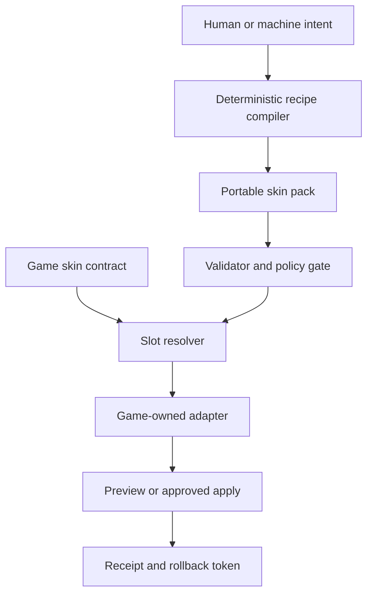

# Architecture

AXM Style Fabric is a separate organ. It does not require existing games to already support skins and it does not overwrite the Foundation.

## Adoption model

Every adopting game provides one small `game-skin-contract.json`. The contract names semantic presentation slots such as:

- `world.sky`, `world.terrain`, and `world.lighting`
- `structure.building` and `prop.interactive`
- `vehicle.body`, `equipment.weapon`, and `item.pickup`
- `character.player.body`, `character.player.detail`, and `character.player.face`
- `ui.panel`, `ui.hud`, `ui.marker`, and `ui.cursor`
- `fx.primary`, `fx.impact`, and `fx.ambient`

A skin binds its materials, tokens, and optional assets to those meanings. A game-specific adapter decides how each meaning maps into CSS variables, Canvas drawing, sprites, shaders, engine materials, or another renderer.

## Six separations

1. **Intent is not a skin.** Intent is compiled into a complete, inspectable pack.
2. **A skin is not a game adapter.** Packs stay portable; games own mappings.
3. **Preview is not apply.** A preview needs no game mutation.
4. **Proposal is not approval.** Machine users can compile and propose; apply requires an explicit approval packet.
5. **Presentation is not authority.** The contract rejects authoritative gameplay fields.
6. **Sharing is not trust.** Imported packs enter validation/quarantine before use.

## Test and conformance separation

The Test Chamber resolves the current portable pack against a selected semantic
mold and displays all 33 authored surfaces, including game-owned fallbacks. Its
per-surface overrides remain presentation-only pack data.

`assessGameAdapterConformance()` is a separate read-only report. Six checks
inspect contract structure; four checks accept declared observations from the
target runtime. The report is not a game adapter, does not execute a renderer,
and always reports `automaticWrites: 0`.

## Layering

Full game skins can be composed from seven isolated organs:

1. world and atmosphere;
2. structures and props;
3. vehicles and equipment;
4. items and projectiles;
5. character regions;
6. effects;
7. interface.

Game fallback remains underneath all seven, and accessibility/local adjustments
can remain above them. Later layers override only declared presentation values.
Every override is listed in the resolution receipt. Source packs remain
unchanged.

## Preskin composition

Built-in preskins sit before compilation, not after resolution:

`preskin or fusion → editable intent → deterministic compiler → ordinary skin pack`

This keeps presets transparent and reusable by humans, machine users, the
visual studio, and future character-design tools. Fusion never mutates the
source catalog. It records both source IDs and the blend amount.

## Graceful capability fallback

A material describes semantic properties such as metallic, roughness, glow, paper grain, outline, or iridescence. A game contract declares what its renderer supports. Unsupported properties are omitted with warnings; they never become gameplay writes.

## Future character-design route

The same system can grow from “character skin” into “character design” by adding animation-safe semantic regions, pose/expression sets, equipment anchors, silhouette constraints, and asset variants. Identity, statistics, abilities, collision bodies, and gameplay behavior remain separate contracts.
